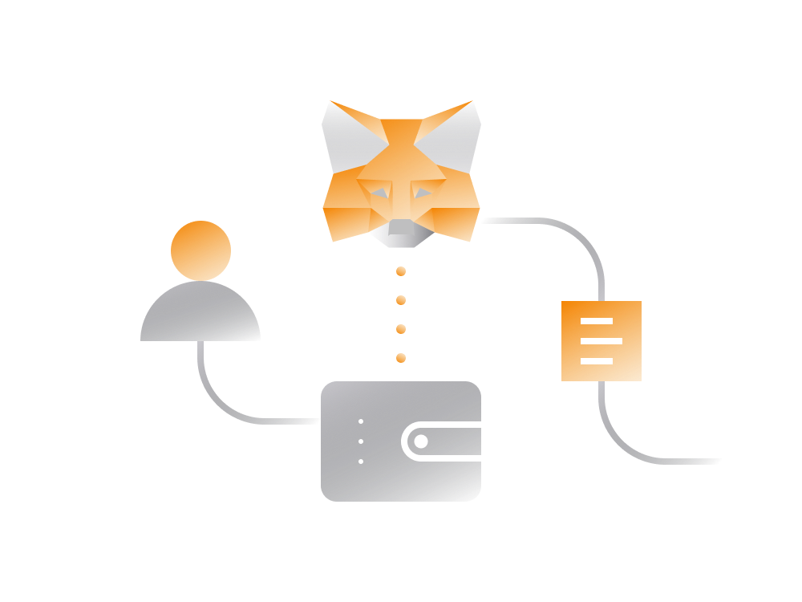
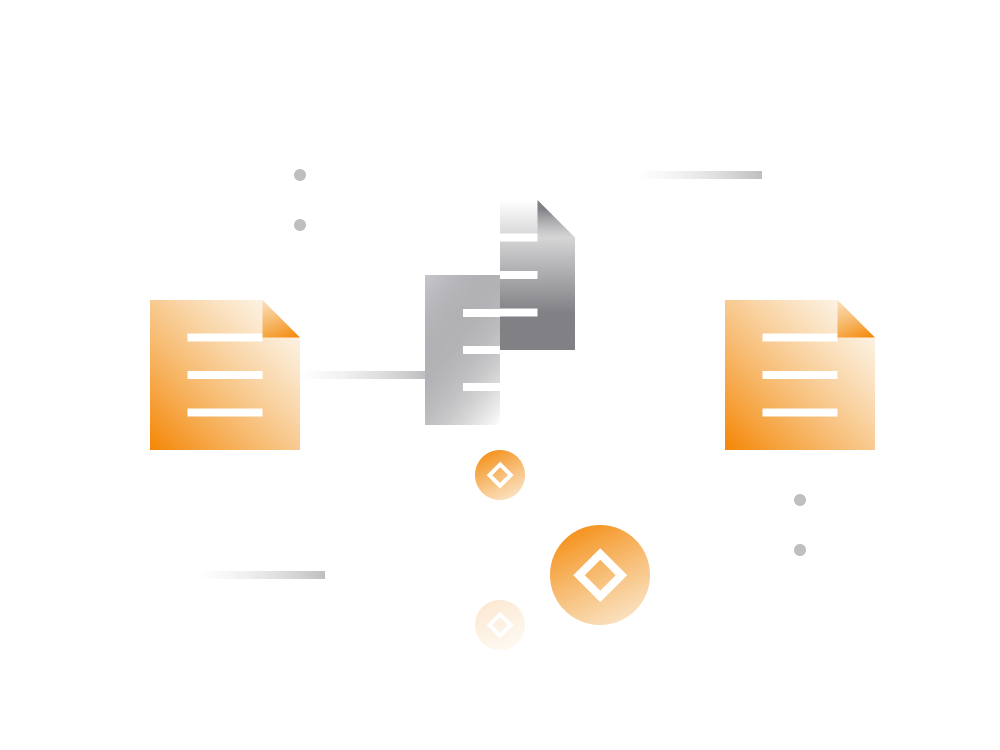

# How To DeFi

The only requirements for someone to start engaging with most DeFi services are the working internet and some amount of cryptocurrency. 

> There are no age, experience, geographical or any other conditions. DeFi services are open to all, at any time.

Let's go over tools and know-how needed to get you started on a practical level.

- A DeFi service can have multiple websites/apps depending on its popularity. Since smart contracts reside on always-online blockchain anyone can build a graphical gateway to them in a form of a website or a mobile app.

- DeFi services require user to connect to the service using a [non-custodial](/guides/fundamentals/2-wallets-basics.md) cryptocurrency wallet. The wallet is your way to authenticate and connect to the smart contract.

The most common way is to use a [Chrome](https://www.google.com/chrome/) browser and a [Metamask](https://metamask.io) non-custodial wallet addon for Chrome. There are also versions for Firefox, Opera and Brave browsers.

Metamask is not the only wallet that you can use for DeFi, but it's by far the most popular one.

## Getting Started

Once Metamask has been installed, an icon the shape of a fox will appear on the top right-hand corner of your browser.

1. Setup Wallet

    Click on 'Get started' on Metamask site and select the option to create a new wallet.

2. Add Password
   
   The password is a necessary measure in case someone gets access to your browser.
   
3. Backup Private Key

   Metamask will provide you with a unique 12-word representation of your [private key](/guides/fundamentals/3-private-keys-basics.md). Make sure to [safely backup](/guides/fundamentals/4-safe-storage-basics.md) that key.

4. Fund Metamask

    Finally, deposit some funds from a wallet where you keep your crypto to your Metamask wallet.

Once funded, open the browser and navigate to the DeFi service website you would like to use and look for 'connect wallet' button or a similar option. Click on it, follow through steps and done.

## DeFi Risks

Majority of DeFi services operate in non-custodial manner where user communicates directly with the smart contracts that control the service. 

> The users always remain in control of the funds and can withdraw funds from the service at any time.

That said, there are also some caveats which makes DeFi a risky place to keep your assets. 

- Should something go wrong with the smart contract powering a DeFi service, there’s no insurance protecting the users' assets on contract's balance.

- Most DeFi products still considered experimental despite operating with large sums of cryptocurrency assets.

So, when it comes to DeFi, if something goes wrong you're on your own to bear the responsibilities. There is no entity to complain to or hold liable should there be an issue.

> We refer to DeFi as 'trustless' because you do not need to trust a third party to serve as an intermediary with your funds -- but you must in fact be able to trust the code and competence of people who built that code.
   
While some major DeFi services go through third-party security audits not all services are able to afford that. 

Therefore, the risk is present in all DeFi products. Keep that in mind and never invest more than you're willing to lose.

There are some DeFi services, like [Nexus Mutual](https://nexusmutual.io) which allow DeFi users to get insured against hacks and vulnerabilities.
