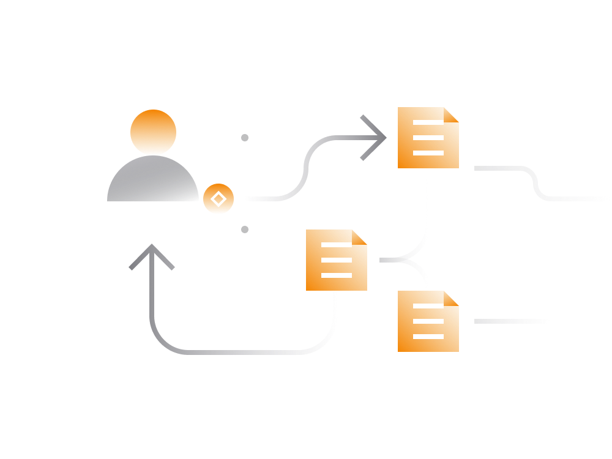
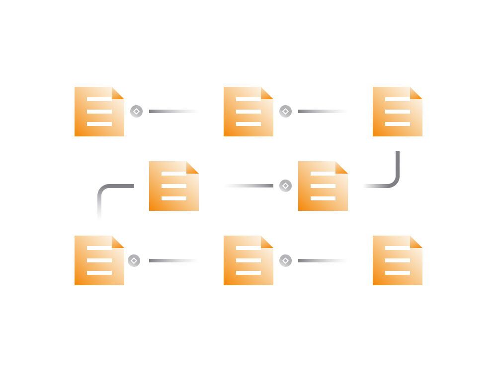

# DeFi Transactions

Generally speaking, there are a number of things someone should know about transacting on DeFi.

- DeFi transactions may have a lot of steps involving conditional logic.

- Complex DeFi transactions require significantly higher processing fees.

- DeFi transactions are as private as the underlying Ethereum blockchain.

## Transaction Complexity

In reality, there are close to no limitations to complexity of DeFi transactions. That's why it's often referred to as programmable money.

The example below assumes a transaction with 8 steps but potentially someone can create a transaction including 100 steps or more.

1. Take an ETH flash loan
2. Send a borrowed ETH to DEX1
3. On DEX1, convert ETH to USDT
4. Send USDT to DEX2
5. On DEX2, convert USDT to USDC
6. Send USDC to DEX3
7. On DEX3, convert USDC to ETH
8. Return ETH loan (keep profits, if any)

By its very nature, DeFi smart contracts are interoperable allowing anyone to programmatically connect multiple DeFi services just like lego blocks.

So, complex DeFi transactions are not uncommon albeit currently limited to those that know the inner mechanics of the ecosystem and some programming experience.

To see a real life example of such transactions, checkout [this post](https://www.coindesk.com/first-mover-how-a-defi-trader-made-an-89-profit-in-minutes-slinging-stablecoins) that looks at transaction where someone made about 40,000$ in a matter of minutes with a single transaction involving a number of DeFi services.

Anyone and anywhere can start experimenting with this using personal cryptocurrency or flash loans if access to capital is limited.

## Transaction Fee

Generic Ethereum transactions that send Ethereum or Ethereum-based tokens from one address to another are typically simple (and therefore lot cheaper) than DeFi transactions.

> Ethereum DeFi transaction are typically complex and require higher processing fees than typical token transfer transactions.

The high fee issue may no longer be relevant when Ethereum blockchain expands its capacity to handle more transactions. 

Until then DeFi transactions costs are likely to keep increasing, especially as DeFi ecosystem and services attract more and more people.

## DeFi Service Fees

DeFi services usually charge small fees for the service. However, some do not have any fees at all. 

For instance, a decentralized exchange charges trader a small service fee for each trade. As a result, with each trade the trader expected to pay:

- a service fee (ex: 0.02 % - 0.04 %) paid to a DEX smart contract
- a transaction fee paid to the Ethereum network nodes

## Approval Transactions

Transaction approvals is another important aspect to grasp.

When user interacts with a smart contract it's not uncommon for a smart contract to require an owner's approval to access his/her capital in order to execute its service.

> Granting a permission works in a form of another 'approval transaction' which is a transaction which doesn't transfer any money but only grants someone (can be a smart contract) a permission to spend a certain amount of your balance for a given token.

Most DeFi services will require an approval transaction to be completed before a uesr can make use of the DeFi service.

## Privacy

As most of the DeFi projects built on top of Ethereum blockchain the privacy on DeFi is basically the privacy you get with the Ethereum. 

All DeFi related transactions will expose your Ethereum address. While there is no way for someone to match that address to your identity it allows the person to see the entire history of actions associated with that address as well as balances for other Ethereum based tokens.

One simple tip to mitigate this is to use multiple Ethereum wallets: 

- For Asset Storage

    This wallet can be used for [safely storing](/guides/fundamentals/en/4-safe-storage-basics.md) your Ethereum tokens and assets. It should not be used for transacting with other entities as it will expose you balances to the receiving party.
     
- For Generic Payments

    Setup a separate wallet for all-purpose transactions. It can be used for transacting with people.
    
- For DeFi Transactions

    Consider setting up yet another wallet for DeFi transactions. Just like the 'storage wallet' this wallet should not be used for transacting with entities, especially ones that know you.
