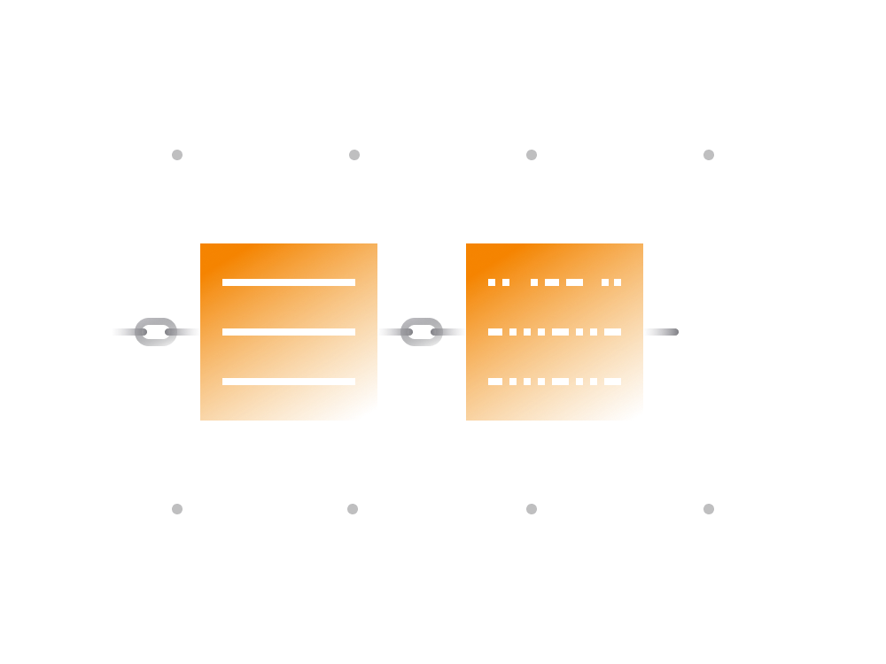

# Cryptocurrency

The aim of this guide is to onboard someone with little knowledge about cryptocurrencies to the comfortable level as quickly as possible.

Cryptocurrencies are powered by a number of technologies, but primarily a blockchain technology. 

>**The blockchain technology was first applied in creating Bitcoin cryptocurrency. By applying this technology it was possible to design an all-accessible platform for value exchange where doing anything outside the scope of agreed rules becomes impossible.**

When using a product built on top of such blockchain following statements hold true:

- user doesn't have to trust anyone
- user doesn't need permission to participate
- user has an unconditional control over assets
- blockchain records are unchangeable

Blockchain technology can potentially be applied to anything where notions like trust, censorship-resistance and immutability are essential. Think notary services, elections and so on.

At the time being, a lot of financial and legal agencies exist to enforce things that can be enforced by a blockchain in impartial manner. Should the blockchain technology continue to grow these services are likely to be ported over to a blockchain.

>**The first generation of blockchain-based products like Bitcoin aim to deliver a financial platform for value exchange without the need for a system to rely on intermediaries such as banks.**

In that regard, the Bitcoin is the first product where the idea of blockchain was applied to challenge areas currently controlled by financial system.

## Blockchain Attributes

So, what is a blockchain? While so many definitions make it sound complicated it's fairly simple in reality.

>**Without going technical, think about a blockchain as a chronological history of records.**
>
>**It can be a history of transactions, a history of votes submitted by electorates etc.**

While the actual history of records is not that special in itself, when it's put on a blockchain it gains certain attributes that make it socially valuable. These attributes are:

- **Distributed Nature**

    Instead of being held in one centralized location, the blockchain allows for the 'history of records' to be held in thousands of locations at the same time. Every copy connected to the internet and gets updated in close to real time.   

- **Peer-to-peer Transmission**

    Anyone can add new records to a global 'history of records' by communicating with any entity that keeps the records. This ensures availability 24/7 and unconditional access to participation.  

- **Transparency & Pseudonymity**

    Blockchains are generally transparent where the entire 'history of records' is public and accessible for anyone for scrutiny. While records are public the entities involved are masked: any third party can see what's taking place but can't tell who exactly was involved.

- **Irreversibility Of Records**

    The blockchains designed in a way where after an action took place it's impossible to change it. This ensures that no entity is able to change something in the history of records.

- **Business Logic**

    In our 'history of records' example we might have unintentionally assumed that these records are of specific type like "User1 paid User2 X bitcoins". The present day blockchains allow adding conditional logic to records. Instead of regular 'A paid B x bitcoins' it can have a record like 'A paid B x bitcoins, but B can't spend them for 10 years'.
   
So, blockchains are a lot more than just plain history of records. The technology opened up ways for a society to organize and exchange in ways that previously required a third party to operate.

## Blockchains Are Free

Generally, blockchains have open source code making it possible for anyone to reuse it for whatever purpose. Both Bitcoin and Ethereum blockchains are open source.

Thousands of engineers worldwide work on improving these blockchains in distributed manner. Major blockchains are constant work in progress and tend to attract more engineers.

While most blockchains created by a small group of people at first, the major blockchain projects now are driven by a large group of independent engineers.

It's impossible for any party to shut down compromise or censor the blockchain network like Bitcoin or Ethereum. 

## Cryptocurrencies Explained

Now let's try to understand the basic nature of cryptocurrency.

Cryptocurrencies are units of something on a blockchain. Depending on the characteristics of underlying blockchain one cryptocurrency may vary from another.

**For instance:**

- Bitcoin cryptocurrency is a native unit of measurement on the [Bitcoin](/token_guides/bitcoin.md) blockchain. It's denoted by a 'BTC' symbol. A single unit of Bitcoin is divisible into 100 million sub-units called Satoshi. By design Bitcoin blockchain caps the total amount to 21 million Bitcoins. The Bitcoin blockchain limited in the type of records it can store, mostly records of transactions from one address to another.

- Ether cryptocurrency is a native unit of measurement on [Ethereum]((/token_guides/ethereum.md)) blockchain, denoted by a 'ETH' symbol. A single unit of Ethereum consists of 100,000,000,000,000,000 wei. Unlike the Bitcoin, Ethereum blockchain doesn't cap the amount of Ether that can potentially exist on the blockchain. Also, Ethereum blockchain doesn't put any limitations in a type of records it can hold.

Some blockchains like Ethereum enable ways to create your own 'units of something' for whatever purpose. These are often referred to as cryptocurrency tokens and can be used for various purposes as will be shown later.

Tokens make up 80-90% of [all cryptocurrencies](https://coinmarketcap.com) out there. The Ethereum blockchain is usually a preferred blockchain platform for creating cryptocurrency tokens.

In a technical sense, the word 'token' should be used to refer to those cryptocurrencies which are built on top of an existing blockchain, rather than having their own unique blockchain. A cryptocurrency token can take many forms depending on its use cases.

## How Cryptocurrencies Grow

Many people wonder why there are so many cryptocurrencies out there and why some are more popular or expensive than others.

While some cryptocurrencies are unique in the way the underlying blockchain is built there are a lot of copy cats. 

As blockchains have an open code anyone can launch a duplicate cryptocurrency without much effort. In that regard, the duplicate won't really be any different from original substantially except for the size of the network.

>**A size of the underlying network is what makes one cryptocurrency more valuable than the other.**

A simple way to think about the size of the network is the number of people interacting with the given blockchain. 

1. The more parties there are participating on the blockchain the bigger is its network. 

2. As the blockchain network grows so is the security and decentralization of the blockchain.

3. As more people join the network the blockchain becomes an open platform for anyone to participate and offer services.

A good example to illustrate this is the Bitcoin blockchain.

The Bitcoin blockchain launched in 2009 and what initially was a fun toy for a small group of people has attracted millions of people over the years. 

>**Nowadays, thousands people run Bitcoin blockchain servers on their computers. By keeping a live copy of the Bitcoin blockchain (history of records) these participants act as both keepers and validators of a blockchain.**
>
>**Even more people participate in the Bitcoin ecosystem by using Bitcoin or by building services around the Bitcoin ecosystem.**

Today, Bitcoin became global and censorship-resistant platform that is open to all. 

The fact that Bitcoin and alike platforms are open and permission-less means anyone can start participating in the ecosystem. That participation can take place both in a form of a regular user or even a service provider. Any entity can build a service operating on top of Bitcoin blockchain.

>**The bigger the network of a blockchain, the more attractive it's for the service providers.**

So, along with the previously mentioned blockchain attributes the key element for evaluating blockchain is its network size. 

The most valuable cryptocurrency is generally the one with the biggest network and not necessarily the one with most features.
