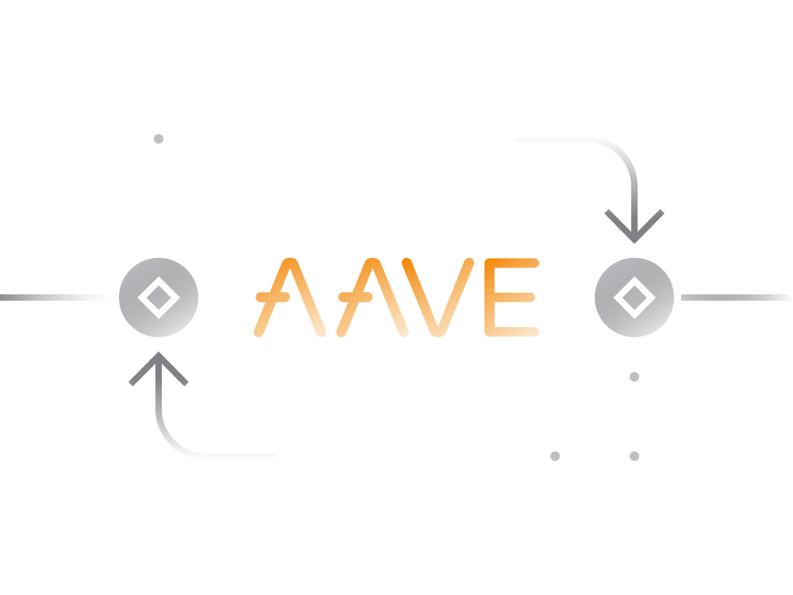

# Aave in Simple Terms

Aave Protocol is a non-custodial Ethereum-based decentralized service that allows users to lend, borrow and trade.

- Depositors provide liquidity by depositing cryptocurrencies into lending pools which will then allow them to earn interest. 

- Meanwhile, borrowers can obtain loans by tapping into these lending pools in either an overcollateralized or undercollateralized way. The loans do not need to be individually matched i.e. one lender to one borrower. Instead, deposits into the pool and the amounts borrowed/ collateral are used to make instant loans based on the pool’s state. There are currently 2 money markets that users can enter into, these are Aave and Uniswap.

## Flash Loans

Aave has one feature that sets it apart from the rest. Flash loans allow customers or to take out loans without any collateral. 

- These flash loans enable a customised smart contract to borrow assets from Aave’s reserve pools within one transaction. 

- The loan is made on the condition that the liquidity is returned to the pool before the transaction ends. 

The Fast Loan feature is primarily available to programmers with trading experience. Flash loans enable someone to participate in activities i.e. artbitrage and refinancing whcih normally require the access to capital.
 
Aave charges a 0.09% fee on flash loans.

## Rate Switching

Rate switching is another unique selling point for Aave, which arrived during the May upgrade of their borrowing/interest rates. Rate switching allows borrowers to switch between fixed and floating interest rates, something useful in a volatile decentralized market. For high-interest rates, users will usually opt for the fixed-rate but when it is more volatile and expected to be lower, one might go for the floating option to reduce borrowing costs. The fixed-rate can change but only when the deposit earning rate increases above the fixed borrow rate as the system could get unstable by paying out more than its being paid. If so, the fixed rate is rebalanced to the new stable rate. On the other hand, when the variable rate is lower than the fixed-rate by 20%, the loan will automatically decrease to account for the difference

Which Cryptocurrency Tokens are linked?

There are 15 tokens available on Aave. These include DAI, USD Coin (USDC), TrueUSD (TUSD), USDT Coin (USDT), sUSD, Binance USD (BUSD), Ethereum (ETH), Basic Attention Token, Kyber Network (KNC), ChianLink (LINK), Decentraland (MANA), Maker (MKR), Augur (REP), SNK, WBTC Coin (WBTC) and Ox Coin (ZRX).

Please note: Each asset has a different collateral requirement. This is because of the differences in price volatility. Stablecoins naturally give loan-to-value ratios, due to their price stability. A full breakdown of Aave’s grading process can be found in their Risk Framework.
Alongside these tokens, there is also a native token that Aave uses and which is called Lend. An explanation and analysis of the token can be found below.

## LEND ($LEND) Token

Often referred too as ETHLend, the LEND cryptocurrency token has rolled over to become the native token of Aave following the winding-up of operations by ETHLend in January this year. Although it has kept the name, the new Aave version of Lend is largely different from the previous one.

Built based on the ERC-20 standard, $LEND tokens can be used for fee reductions. The tokens are burnt from the fees collected from the Aave Protocol, with around 80% of platform fees used. This appears to suggest that Lend tokens will be worth more over time. LEND owners can also claim on protocol fees in exchange for acting as the first line of defense in the case of liquidity events by malicious borrowers.

In addition, $LEND tokens can be used for voting on Aave Improvement Proposals (AIPs). What’s more, LEND holders can vote with their LEND deposited on the Aave platform, even if it is currently being used as collateral. Currently, this feature is pre-launched on the Ropsten test network before it is launched on the Ethereum mainnet. This is so the Aave community can vote on proposals without incurring huge gas costs, try out the module and provide feedback to the Aave team before it is formally launched. It is also worth noting that the outcomes of all votes on the testnet are not considered as valid for the long term.
