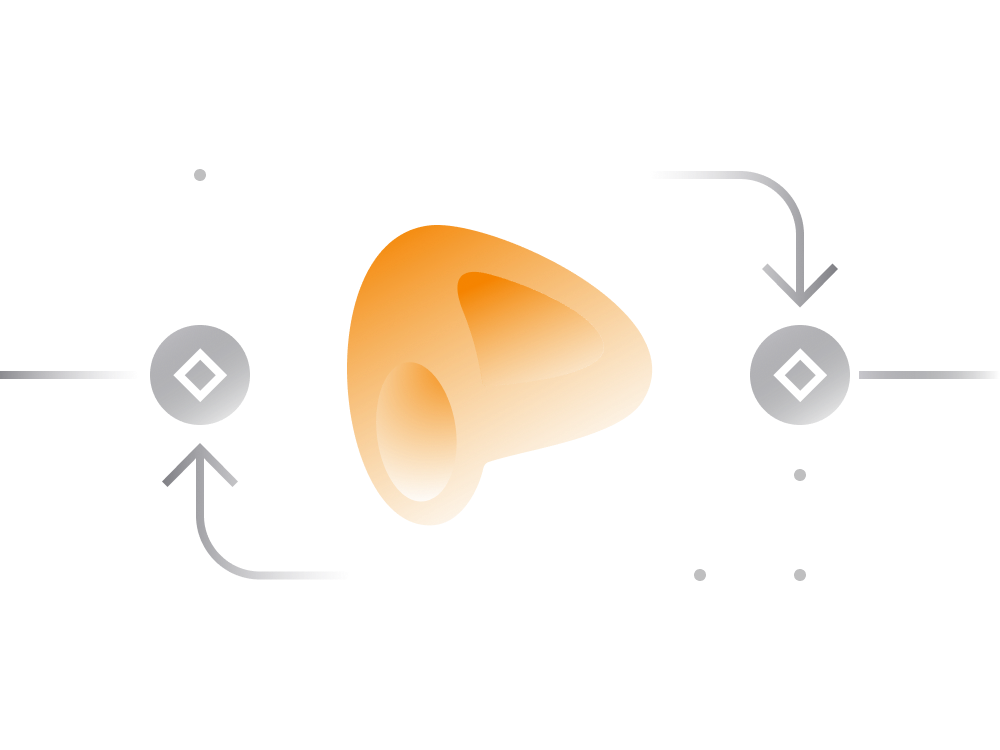

### 2. Curve Finance DEX

[Curve Finance](https://curve.fi) is a decentralized, Uniswap-like exchange but built specifically for [stablecoins](/guides/defi/8-stablecoins.md).

With DeFi growing in popularity there is a bigger demand now for trading between pairs of stablecoins, and that’s where Curve comes into play. Stablecoins are typically in high demand in DeFi ecosystem. 

Curve has a large turnover volume, frequently exceeding over [50 million USD](https://www.curve.fi/dailystats). 

## Curve Token

Curve DEX plans to become a DAO and has a governance token (symbol: CRV) which provides [additional perks](https://guides.curve.fi/crv-launches-curve-dao-and-crv/) when interacting with Curve services including voting capabilities on important decisions.

Total supply: about 3 billion

- 61% to liquidity providers
- 31% to shareholders
- 5% to burnable reserves
- 3% to employees

## Trading on Curve

- Curve's uniques selling point comes from its trading algorithm which provides better prices when buying or selling large amount of cryptocurrency stablecoins.

- In comparison to [Uniswap](/guides/token_guides/uniswap.md), Curve has a slightly higher fee for each trade measured at 0.04% of the trading amount.

## Liquidity Providers

- Apart from collecting trading fees, Curve's liquidity pools lend spare funds to external [DeFi lending](/guides/defi/4-lending-protocols.md) services and earn liquidity providers even more income. Only some liquidity pools on Curve use lending protocols.

- Curve liquidity pools do not require liquidity provider to deposit all tokens involved in the pool. The provider can just deposit one stablecoin.

- Liquidity pools on Curve are generally more profitable also due to the fact that liquidity pools consist of 'stable' assets. 

- Liquidity providers may also deposit just one token and choose to provide liquidity to all the pools instead of just one.

- At present, 4 out of 7 liquidity pools on Curve earn liquidity providers not only from trading fees but from lending liquidity to Compound lending pool as well.

- Some Curve pools offer additional bonuses: if a deposited token has a low share of the pool, you may earn a deposit bonus. Conversely, you may earn a bonus if you withdraw a particular stablecoin that's predominant in the pool.

## Pool Profitability
 
- When depositing funds to a liquidity pool, regardless of whether you are depositing multiple tokens or just one, your deposits will be auto-split into multiple tokens based on token distribution in the pool.

- If you decide to deposit 4 DAI tokens to the pool that has 200 DAI (50%), 100 USDT (25%) and 100 USDC(25%) tokens, then your deposit will be split in 2 DAI, 1 USDT and 1 USDC.

- When withdrawing from a pool you will be typically withdrawing in all pool tokens, regardless of which token you deposit.

- Due to versatile pool deposit mechanisms, adding funds to liquidity pools can be quite expensive when Ethereum network is busy.

Curve Finance significantly more complex than Uniswap and integrates more third party DeFi services into its products. 

Therefore, Curve Finance carries more security risks.
